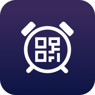

   

<h1 align="center"><b>QRAlarm</b></h1>

*QRAlarm* is an Android alarm clock application that does not only wake You up, but also makes You get up to disable the alarm by scanning the QR Code.

   
   

## Screenshots

  
     
     
     
     

  

## Setup
* Download [qralarm-android-signed.apk](https://github.com/sweakpl/qralarm-android/releases),
* Put it e.g. in a `Downloads` folder in Your Android device,
* Go to the `Downloads` folder on the Android device,
* Tap the file and install - the app doesn't require any special permissions,

or download it from [F-Droid](https://f-droid.org/packages/com.sweak.qralarm/) or [IzzyOnDroid](https://apt.izzysoft.de/fdroid/index/apk/com.sweak.qralarm/).

## Attribution

#### Sounds attribution
* "Alarm Clock" by Mike Koenig http://soundbible.com/535-Alarm-Clock.html License: Attribution 3.0
* "Airhorn" by guitarguy1985 https://soundbible.com/1080-Airhorn.html License: Sampling Plus 1.0
* "Gentle Guitar" by Rasputin https://www.looperman.com/loops/detail/230868/gentle-guitar-77bpm-folk-acoustic-guitar-loop
